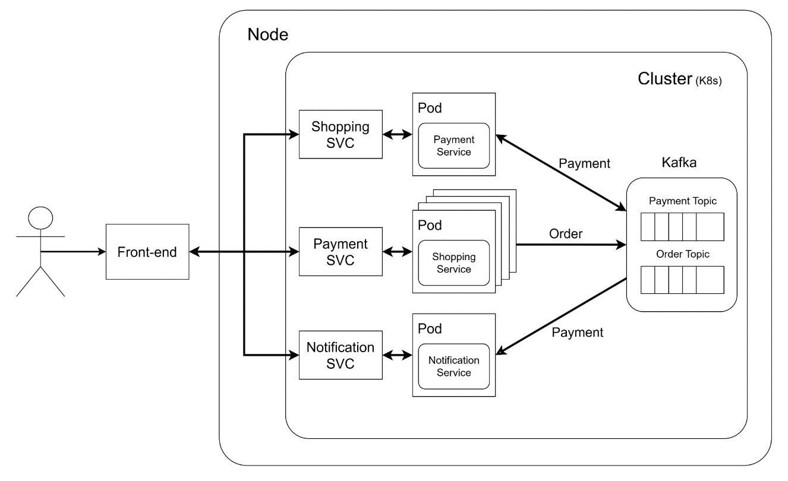
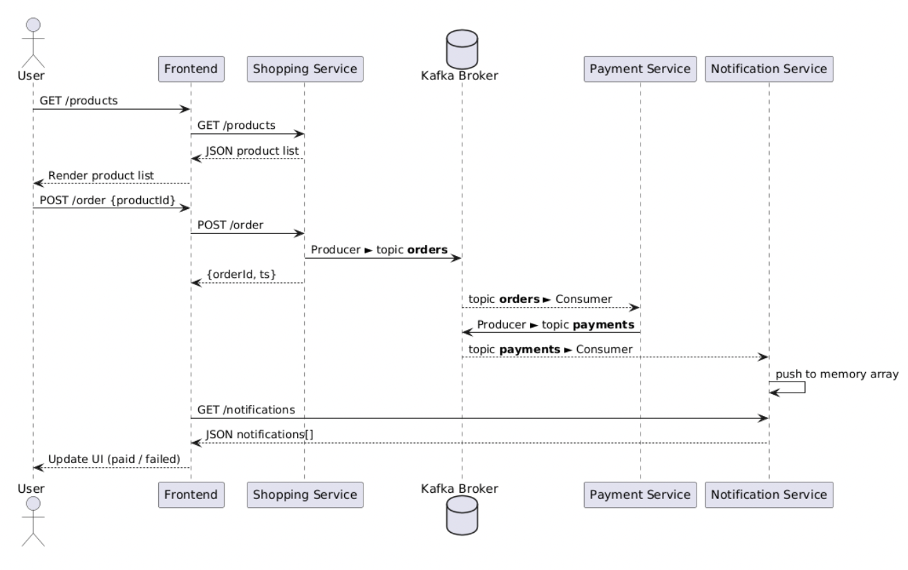
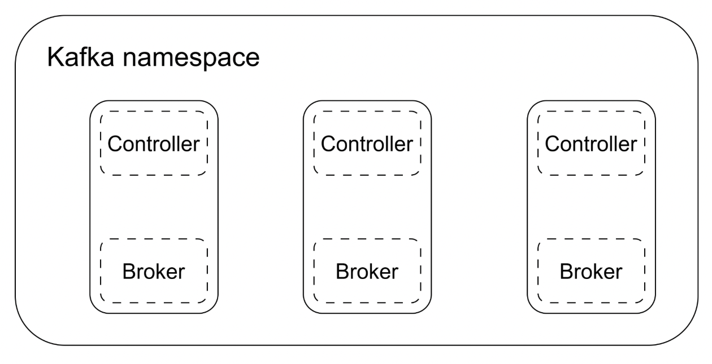
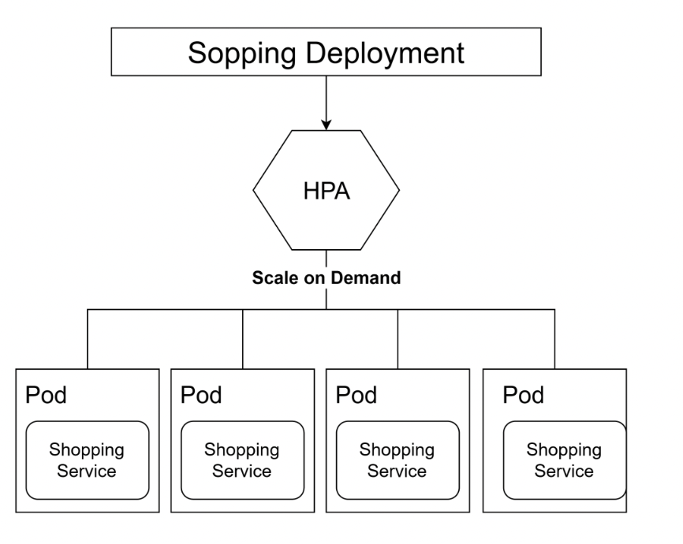

# Distributed_ECommerce
<div align="center">
  
  <div><em>Components Diagram</em></div>
</div>

&nbsp; &nbsp;

This repository contains a sample microservices-based distributed e-commerce system, implemented in Node.js and deployed on Kubernetes. It includes the following services:

* shopping-service: exposes /products and /order endpoints; produces order messages to Kafka.
* payment-service: consumes the orders topic, simulates payment, and produces payments topic messages.
* notification-service: consumes the payments topic, stores notifications in memory, and exposes /notifications.

* frontend: a Pug and SCSS-based web UI that interacts with the backend services.

A Kubernetes manifest directory (k8s/) is provided to deploy the entire stack, including Deployments, Services, and a configurable HorizontalPodAutoscaler. Docker images are built and pushed via the dockerhub.bash script.

<div align="center">
  
  <div><em>Sequence Diagram</em></div>
</div>

&nbsp; &nbsp;

<div style="display: flex; justify-content: center; gap: 20px;">
  <div>
    
    <div style="text-align:center"><em>Kafka using Helm Chart</em></div>
  </div>
  <div>
    
    <div style="text-align:center"><em>HPA for shopping service</em></div>
  </div>
</div>

## Key Distributed System Techniques:
* K8S
* Kafka

## Prerequisites
* Node.js v20 (LTS)
* Docker & Docker CLI
* Kubernetes cluster (e.g., k3s)
* kubectl configured to target your cluster
* Kafka cluster accessible by the services (e.g., deployed via Helm chart)
* (Optional) Docker Hub account credentials for image publishing

## Installation
1. Clone the repository
```bash
git clone https://github.com/mao-code/Distributed_ECommerce.git
cd Distributed_ECommerce
```

2. Deploy Kafka (if not already running)
```bash
helm repo add bitnami https://charts.bitnami.com/bitnami
helm install kafka bitnami/kafka -n kafka --create-namespace -f k8s/kafka-values.yaml
```

## Deployment
1. Apply Deployments
```bash
sh ./apply.bash
```

## Usage
1. Execute Frontend App locally
```bash
cd frontend
npm install
npm run build
npm start
```

2. Interact with the application
   1. Browse products on the frontend.
   2. Place an order; the shopping service will publish to Kafka.
   3. The payment service will consume the order and publish a payment event.
   4. The notification service will consume the payment event and surface notifications.

## License
This project is licensed under the MIT License.